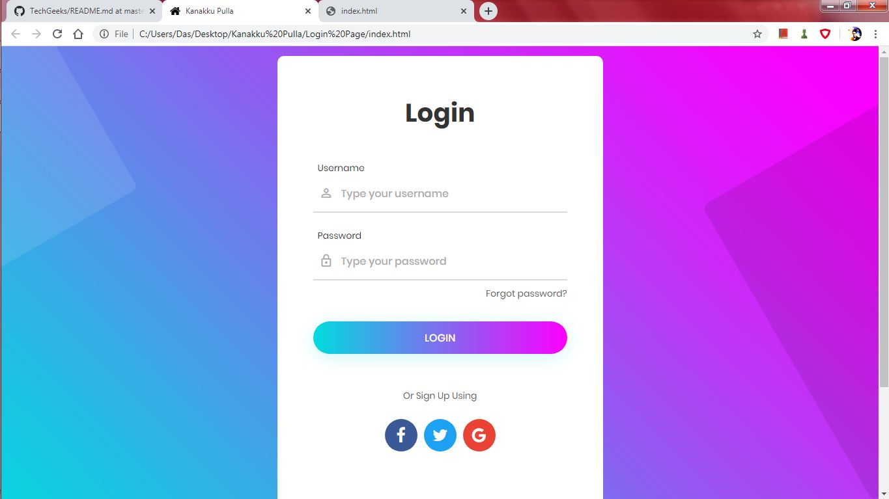
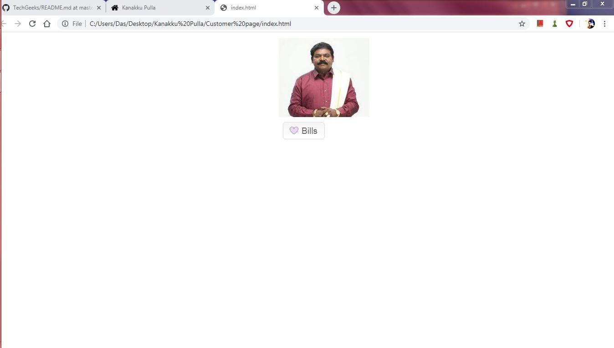
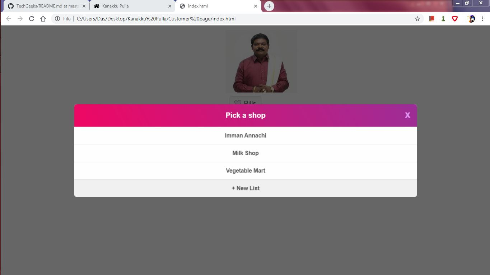
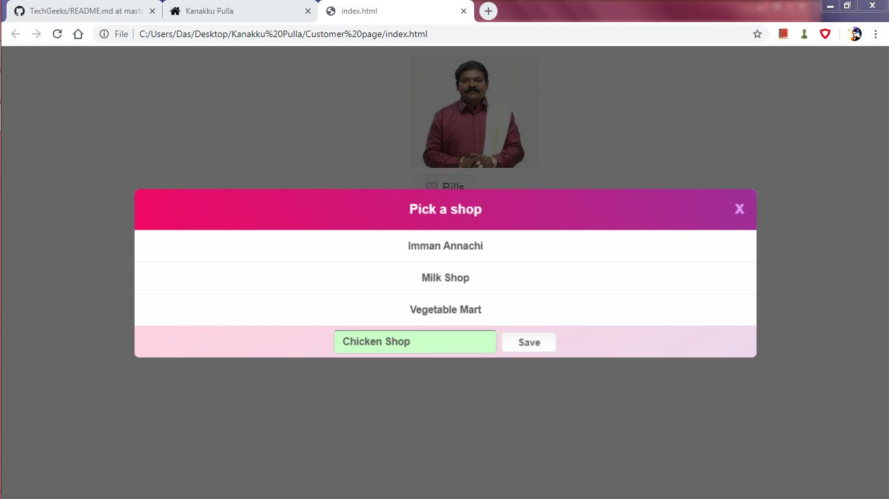
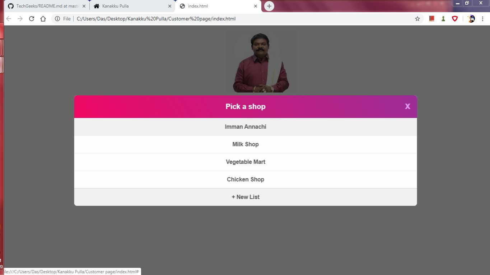

# Kanakku Pulla
1. Open Login Page Folder and index.html file inside it.
2. You can see the Login Page where the customers and Shopkeepers can register.
3. Open Customer Page folder and index.html file in it.
4. You can click the Bills icon and add Pending Bills with the items and shop's name.
5. The file project.py is used to store user inputs in a database.
6. Look for the Output document in the OUTPUT folder for understanding the backend.

Here are some screenshots of our Output:

